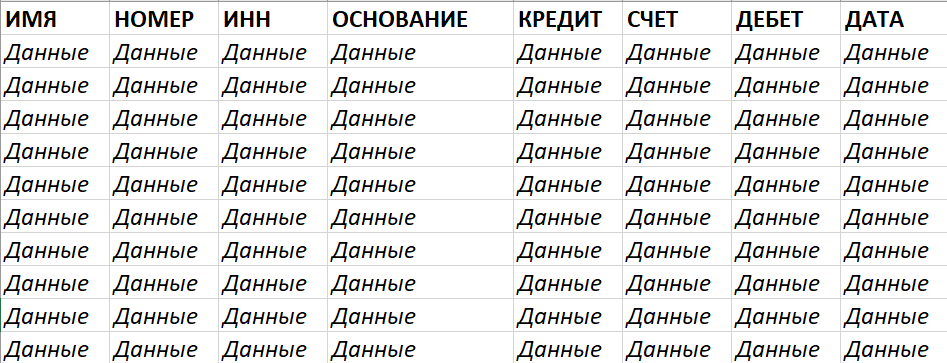

# Подготовка таблицы

Для того, чтобы программа могла успешно считать данные из выписки, нужно определенным образом указать на них в самой
таблице.

Лист, с которого будут браться данные должен называться ТАБЛИЦА.

Существует список ключевых слов, на которые ориентируется программа. Ключевые слова должны быть расположены на первой
строке. Каждое из них явно указывает, что столбец стоит расценивать, как данные определенного типа.

| Ключевое слово | Тип данных |
| --- | --- |
| НОМЕР | Номер документа |
| ИМЯ | Имя организации |
| ДАТА | Дата совершения операции |
| ИНН | ИНН организации |
| СЧЕТ | Номер счета организации |
| ДЕБЕТ | Значение по дебету |
| КРЕДИТ | Значение по кредиту |
| ОСНОВАНИЕ | Описание операции |

---

*Пример подготовленной таблицы*
