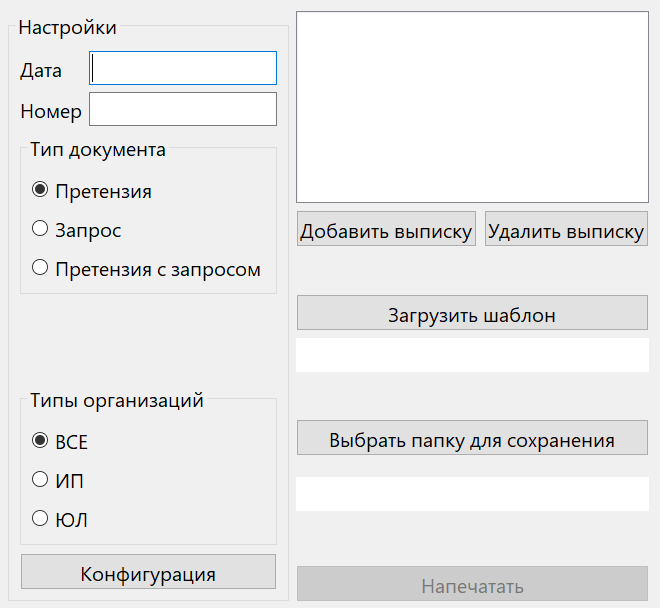

# Инструкция по использованию

После сборки приложения или получения *.exe файла иным образом, запустите приложение.

*Интерфейс приложения*

Перед вами окажется окно со множеством полей, разберем каждое чуть более подробно.

### Раздел настроек

В разделе настроек находятся конфигурационные поля.

+ **Дата** - строка, на которую будет заменяться ключевое слово **ДАТА**
+ **Номер** - строка, на которую будет заменяться ключевое слово **НОМЕР**

#### Тип документа

+ Претензия: отбираются только записи по дебету.
+ Запрос: отбираются только записи по кредиту.
+ Претензия с запросом: отбираются все записи.

#### Тип организаций

+ ИП: отбираются только записи по индивидуальным предпринимателям.
+ ЮЛ: отбираются только записи по юридическим лицам.
+ Все: отбираются все записи.

#### Конфигурация

По нажатию на кнопку открывается текстовый документ в формате json, содержащий иные настройки приложения. Не
рекомендуется менять его содержимое, если нет четкого понимания собственных действий.

### Рабочая область

#### Добавление выписки

Для того, чтобы добавить выписку, необходимо нажать на кнопку
"Добавить выписку", после чего откроется обозреватель файлов, в котором выбрать файл выписки.

#### Удаление выписки

Для того, чтобы удалить выписку, необходимо нажать на удаляемый файл выписки в списке всех загруженных выписок, а после
нажать на кнопку "Удалить выписку".
